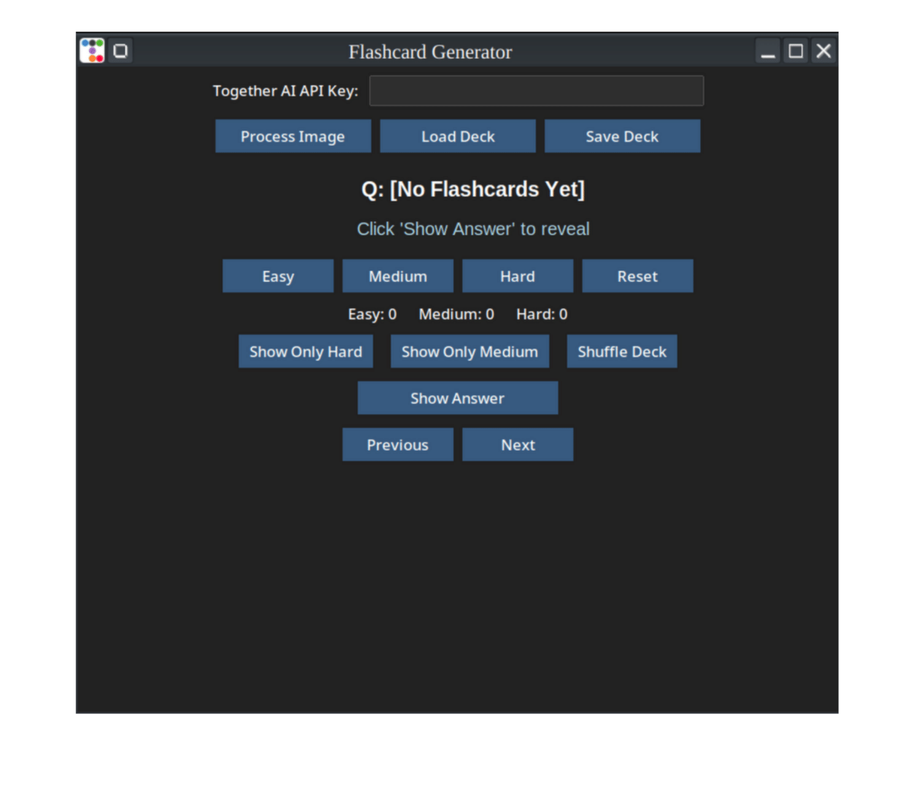
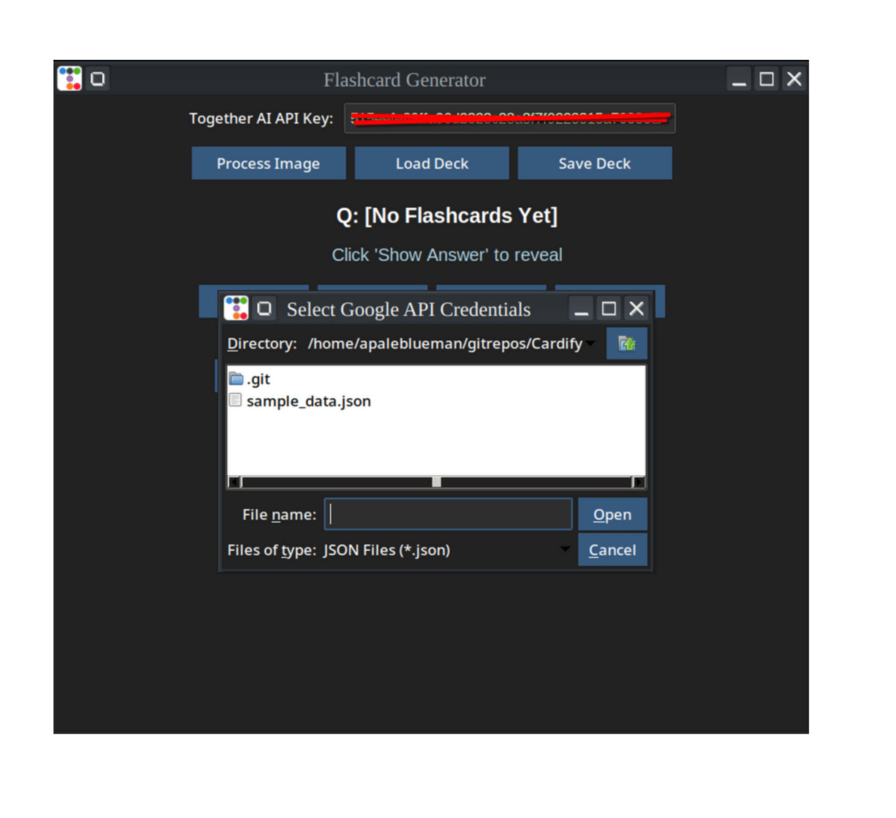
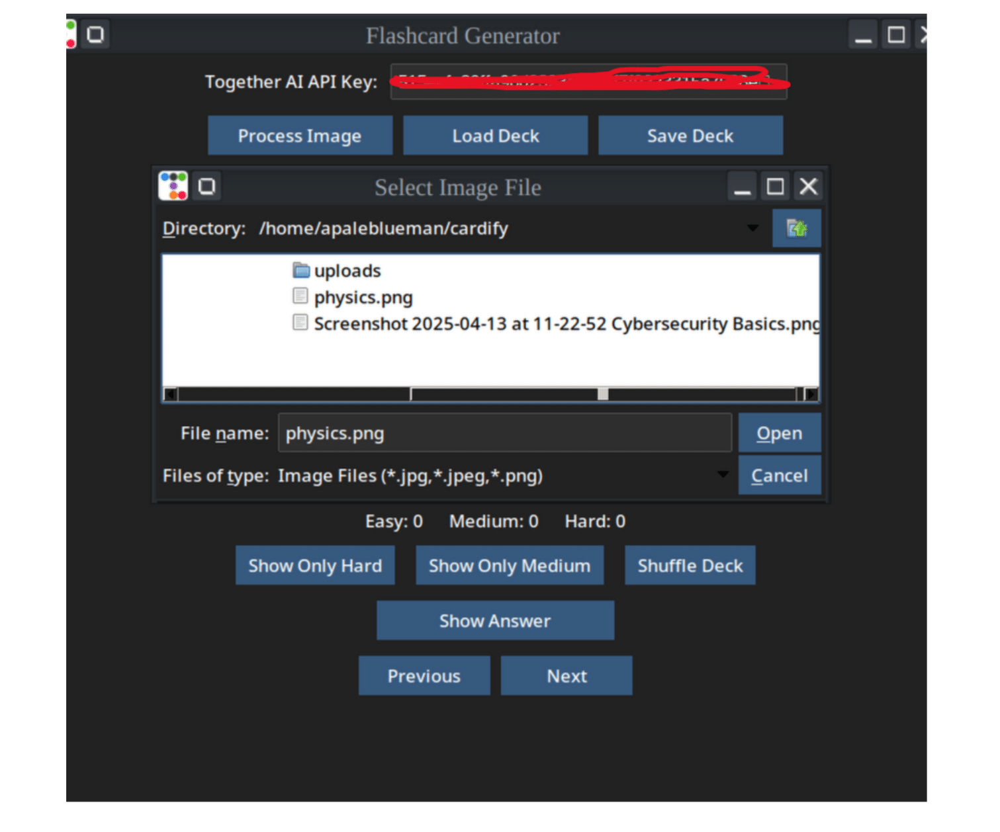

# Cardify
from notes to review flashcards - instantly!
To run the given Python script on your workstation, you need to install several Python packages using `pip`. Here's a complete list based on the imports and functionality used in your script:

---

### ✅ **Install These Packages via pip**

```bash
pip install google-api-python-client google-auth google-auth-oauthlib
pip install requests
pip install Pillow
pip install ttkbootstrap
```

---

### ✅ **Additional Notes for Fedora (System Packages)**

- **Tkinter** may already be installed with Python, but if not:
  ```bash
  sudo dnf install python3-tkinter
  ```

- **Pillow** needs image libraries; if you face any issues with image loading:
  ```bash
  sudo dnf install libjpeg-turbo-devel zlib-devel
  ```

- **If you want a virtual environment (recommended):**
  ```bash
  python3 -m venv venv
  source venv/bin/activate
  ```

---

### 📦 **Summary of pip packages**
| Package             | Purpose                                      |
|---------------------|----------------------------------------------|
| `google-api-python-client` | Access Google Drive & Docs APIs       |
| `google-auth`              | Authenticate using service account     |
| `requests`                 | Make HTTP requests to Together API     |
| `Pillow`                   | Load and display images                |
| `ttkbootstrap`             | Themed modern GUI using `ttk`          |






